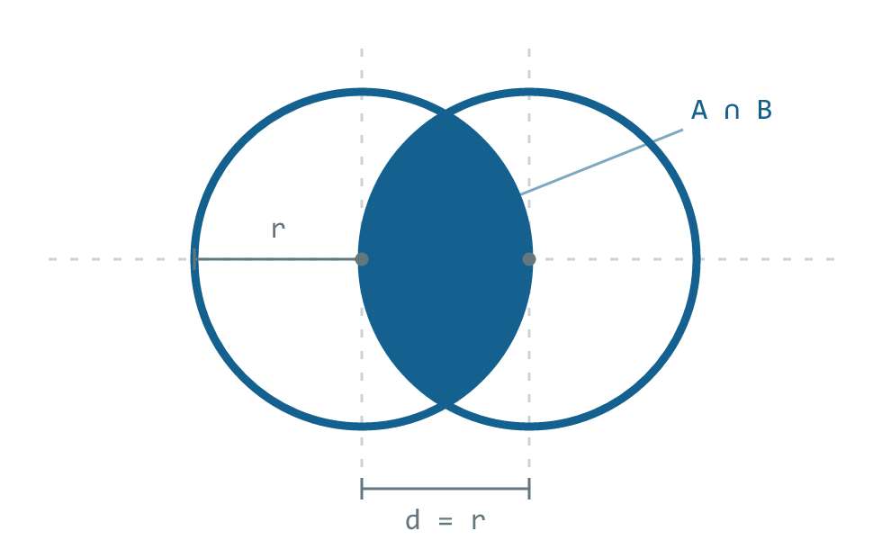

<div align="center">

<picture>
  <source media="(prefers-color-scheme: dark)" srcset="docs/assets/logo-dark.png">
  
</picture>

<h1>Venn</h1>

**A general-purpose language that takes testing seriously.**

Faster than CPython. Beats hand-written TypeScript on three of seven benchmarks.<br>
Small enough to read in an afternoon.

[](https://github.com/venn-lang/venn/actions/workflows/ci.yml)
[](https://codecov.io/gh/venn-lang/venn)
[](https://github.com/venn-lang/venn/actions/workflows/security.yml)
[](LICENSE)
[](package.json)

<sub>

[Install](#install) · [Why Venn](#why-venn-exists) · [Performance](#performance) · [The language](#the-language) · [Testing](#testing) · [Examples](examples) · [Roadmap](ROADMAP.md) · [Contributing](#building-from-source)

</sub>

</div>

<br>

```ruby
use "venn/http"

flow "Checkout" {
  let cart = http.post "https://shop.test/cart" { body: { sku: "A-12" } }

  step "Item is in the cart" {
    expect cart.status == 201
  }
}
```

No `async`. No `await`. No runner to configure, no assertion library to choose,
no mocking framework to learn. The language already knows what a test is.

---

## Install

```bash
npm install -g @venn-lang/venn
```

Needs Node 24. That installs the `venn` command, which is small and carries no
language of its own: it fetches the newest one in the background, and hands
each project to the version that project asked for. Then:

```bash
venn new my-suite && cd my-suite
```

That writes `venn.toml`, `src/main.vn` and a `.gitignore`. Put a flow in
`tests/first.vn`:

```ruby
flow "arithmetic still works" {
  step "two and two" {
    expect 2 + 2 == 4
  }
}
```

And run it:

```bash
venn test
```

```
 RUN  tests/first.vn

 ❯ arithmetic still works
   ✓ two and two 0ms

 Tests  1 passed (1)
  Time  56ms
```

`venn run src/main.vn` runs a file as a program, `venn check .` checks without
running, and `venn version` is how a machine holds more than one version of the
language at a time. Full command list under [Tooling](#tooling).

---

## Contents

**Getting oriented**
[Install](#install) ·
[Why Venn exists](#why-venn-exists) ·
[Performance](#performance) ·
[Building from source](#building-from-source)

**The language**
[Values and functions](#values-and-functions) ·
[Units](#units) ·
[Types](#types) ·
[Decorators](#decorators) ·
[Waiting, without async](#waiting-without-async)

**Using it**
[Testing](#testing) ·
[Servers](#servers) ·
[The standard library](#the-standard-library) ·
[Errors](#errors) ·
[Tooling](#tooling)

**Under the hood**
[Architecture](#architecture) ·
[Repository layout](#repository-layout) ·
[Status](#status)

---

## Why Venn exists

Every testing tool is a library bolted onto a language that never asked for one.
You assemble a runner, an assertion library, a mocking framework and a reporter,
then you maintain the seams between them forever.

Venn inverts it. The **language** knows what a test is. What it deliberately does
not know is HTTP, browsers, databases or queues: the grammar contains no test
verbs at all. It knows structure, which is blocks, steps, control flow and
expressions. Every verb you will ever call lives in a registry that libraries
fill at run time.

> **Adding a new protocol never touches the parser.**

That one decision is why the whole thing stays small, and why the same compiler
runs in your editor's Web Worker and in your CI.

---

## Performance

A tree-of-closures interpreter with no JIT and no code generation, measured
against the same algorithm hand-written in TypeScript on V8, and in CPython.

| workload | Venn | TypeScript (V8) | CPython |
| :--- | ---: | ---: | ---: |
| **50k reductions** | **1.28 ms** | 2.09 ms | 2.87 ms |
| **50k branches** | **1.82 ms** | 2.14 ms | 3.42 ms |
| **50k loop iterations** | **1.65 ms** | 2.06 ms | 1.73 ms |
| 20k records built and filtered | 1.86 ms | 1.19 ms | 2.88 ms |
| 5k record pipeline | 1.30 ms | 0.59 ms | 1.43 ms |
| 10k interpolated strings | 1.75 ms | 1.00 ms | 1.28 ms |
| recursion, `fib(25)` | 5.11 ms | 0.63 ms | 8.92 ms |

<table>
<tr>
<td align="center" width="33%">

### ~1.3×
**the speed of CPython**

<sub>ahead on five of seven workloads</sub>

</td>
<td align="center" width="33%">

### 3 of 7
**workloads beat V8**

<sub>reductions, branches, loops</sub>

</td>
<td align="center" width="33%">

### ~65%
**of V8's speed overall**

<sub>up from 34%, and still climbing</sub>

</td>
</tr>
</table>

Getting from 34% of V8 to here meant removing every allocation a call did not
need. A function of one parameter now runs with **no frame at all**: the argument
*is* the environment. Free names resolve to cells addressed once when the closure
is built, so a recursive call never searches for its own name. Each operator
compiles to a thunk written for that operator alone. Nothing allocates a list to
hold a single argument.

The numbers move a few percent between runs, so treat the ratios as the result
rather than the milliseconds. Reproduce them yourself:

```bash
pnpm run bench
```

---

## The language

### Values and functions

```ruby
fn double(x) => x * 2
fn clamp(value, low, high) {
  const lower = value < low ? low : value
  lower > high ? high : lower
}

const twice = (f, x) => f(f(x))

print twice(double, 5)          # 20
print clamp(120, 0, 100)        # 100
```

Functions are values: bind them, pass them, call them. A block body returns its
last expression, and `return` exists only for leaving early. Declarations are
hoisted, so order never matters.

**There is no assignment.** A name binds once and holds that value forever, which
is exactly what lets the compiler resolve every read to an index.

### Units

A number can carry a unit, and the unit survives arithmetic and comparison:

```ruby
const budget = 2mb
const timeout = 300ms + 1s
const rate = 99.9%

expect response.duration < timeout
expect response.size <= budget
```

Adding a duration to a size is a type error, not a silent number.

### Types

Inferred by Hindley-Milner, so annotations are optional and checked where you
write them:

```ruby
type Order {
  id: number
  total: number
}

fn discounted(order: Order) -> number => order.total * 0.9
```

Anything the checker cannot prove stays `dynamic` and is left alone. The type
system helps without ever blocking a run.

### Decorators

Written in Venn itself. The type of the first parameter is what the decorator may
be applied to, so putting one in the wrong place is a type error caught before
anything runs:

```ruby
## Doubles whatever the function gives back.
deco doubled(target: Fn) {
  target.wrap(fn (call, args) => call(args) * 2)
}

@doubled
fn five() => 5

print five()                    # 10
```

They run at expansion time, before the program exists, which is why they are
pure: there is nothing yet for them to call a verb on.

### Waiting, without async

```ruby
const user = http.get "https://api.test/user/1"
print user.json.name
```

A function that reaches for something slow hands back a value that is still
arriving, all the way up, until a statement binds it. No `async`, no `await`, and
no colour on your functions.

---

## Testing

A `flow` is a test. A `step` is a named piece of one, and it is what appears in
the report and in the failure trace.

```ruby
use "venn/http"
use "venn/assert"

flow "Sign-up" {
  let created = http.post "https://api.test/users" { body: { email: "a@b.c" } }

  step "The account exists" {
    expect created.status == 201
    expect created.json.email == "a@b.c"
  }

  step "And it can sign in" {
    let session = http.post "https://api.test/session" { body: { email: "a@b.c" } }
    expect session.json.token != null
  }
}
```

```bash
venn test .                 # run every flow
venn test . --tags smoke    # run a subset
venn list .                 # show what would run, without running it
```

A binding made at flow level is visible in every step; one made inside a step
belongs to that step. Beyond this there are lifecycle hooks (`on`, `defer`),
expected failure (`try`), concurrency (`parallel`, `race`, and a `concurrency`
option on `forEach`), and `matrix` for running one flow across variants. All of
it is in [`examples/testing/`](examples/testing).

## Servers

Venn can start a real server and assert against it in the same file, which is
what makes an integration test a single file with no fixtures around it. See
[`examples/servers/`](examples/servers).

---

## The standard library

Nineteen namespaces, two hundred verbs, none of them known to the grammar. Each
arrives through `use`:

`artifacts` · `assert` · `auth` · `browser` · `crypto` · `data` · `db` · `env` ·
`fmt` · `gql` · `grpc` · `http` · `io` · `load` · `mail` · `mock` · `mqtt` ·
`notify` · `ws`

Plugins are ordinary packages. Writing one means calling `definePlugin` from
[`@venn-lang/sdk`](packages/sdk), and a single `defineAction` feeds the runtime, the
language server and the node graph at once.

## Errors

Every failure, from the parser and the runtime alike, is a `Problem` with a
stable `VNxxxx` code. The title is a sentence in your domain, not the compiler's:

```
VN6001  The card never became ready
        in expect row.status                 src/checkout.vn:231:7
        in step "Reconcile in the database"  src/checkout.vn:228:5
        in flow "Checkout"                   src/checkout.vn:88:1  (attempt 2 of 3)
```

Diffs are structured, never stringified. Secrets are redacted where they are
produced rather than where they are shown, so by the time a value reaches a
reporter it is already `‹redacted›` and no reporter can leak it by accident.

## Tooling

One binary:

```bash
venn new my-suite      # start a project
venn run file.vn       # run a file as a program
venn test .            # run every flow as a test suite
venn check .           # type-check without running
venn fmt .             # format in place
venn build             # check every target and record the build
venn add zod           # add an npm dependency
```

And one more, for the versions of the language themselves:

```bash
venn version list          # what is installed, and which one this directory uses
venn version install 0.2   # fetch one, or the newest a range allows
venn version use 0.2       # pin this directory to it, in venn.toml
venn version remove 0.1.3  # take one off the machine
```

`list` marks the one in use and says where that came from, because someone
asking has usually just been surprised by the answer, and seeing that a
`venn.toml` two directories up asked for `0.2.x` ends the question.

A project pins its version in `venn.toml`, so everyone working on it runs the
same compiler, and moving to a new one is a change to a file that is reviewed
like any other. The editor reads the same pin, so what it underlines is what
`venn check` prints.

The language server is complete: hover, completion, go to definition, find all
references, rename, signature help, document highlight, semantic highlighting and
formatting. npm packages work directly, types included:

```ruby
import { z } from "zod"
```

---

## Architecture

Every port in the runtime ships with **two implementations**, the real one and a
test double, plus a conformance suite that both must pass. If a second
implementation cannot be named, it does not become a port.

That rule is why the core has no idea what a filesystem is, and why the same
compiler runs in a Web Worker for the editor and in Node for the CLI. All I/O
arrives as an injected port, negotiated against the host's capabilities before
anything runs, so a missing capability is a readable diagnostic rather than a
`TypeError` in the middle of a test.

## Building from source

Installing it is one line and lives [up there](#install). This is for working on
the language itself. Needs Node 24 and pnpm 11.

```bash
pnpm install
pnpm -r --sort run build
pnpm test

node packages/cli/dist/bin/venn-run.mjs test examples/testing/
```

Then read [`examples/`](examples): 38 files that all run, from
[`basics/01-hello.vn`](examples/basics/01-hello.vn) through to matrices and
concurrency.

## Repository layout

| package | what it is |
| :--- | :--- |
| [`@venn-lang/core`](packages/core) | Grammar, parser, type checker, expression compiler, IR |
| [`@venn-lang/runtime`](packages/runtime) | Scheduler, plugin registry, scopes, event stream |
| [`@venn-lang/contracts`](packages/contracts) | Ports, host capabilities, conformance harness |
| [`@venn-lang/sdk`](packages/sdk) | Everything a plugin author touches |
| [`@venn-lang/cli`](packages/cli) | The `venn` binary |
| [`@venn-lang/lsp`](packages/lsp) | Language server |
| [`@venn-lang/types`](packages/types) | The type vocabulary as plain data |
| [`@venn-lang/project`](packages/project) | Manifests, workspaces, build profiles |
| `packages/std-*` | The standard library, one package per namespace |

## Status

Venn is pre-1.0 and moving quickly. The syntax is settling but is not frozen, and
[`docs/known-gaps.md`](docs/known-gaps.md) is an honest list of where the
specification and the implementation still disagree.

The suite runs green: build, typecheck, lint, and 1292 tests across 213 files.

If you are here early, the most useful thing you can do is try it and say where
it got in your way.

<div align="center">
<sub>Text and node graph are the same thing seen from two angles.</sub>
</div>
